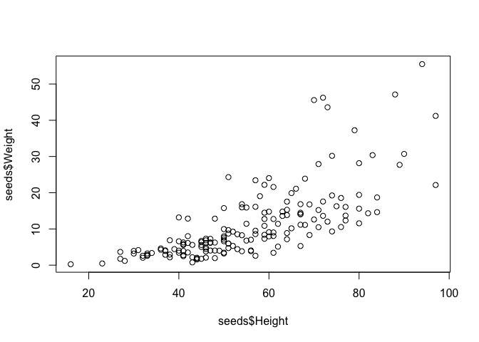
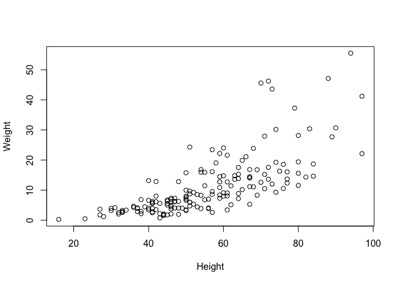
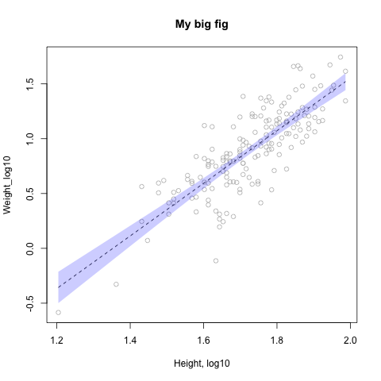

Notebook
================

Allometry Project
-----------------

> How does plant mass scale with height?

-   No relationship
-   Linear
-   To the third power
-   To the second power

Load our data
-------------

``` r
seeds <- read.csv("https://raw.githubusercontent.com/jmadin/himbr/master/data/seed_root_herbivores.csv", as.is=TRUE)
```

A function for standard error
-----------------------------

``` r
standard_error <- function(x) {
  sd(x) / sqrt(length(x))
}
```

Plotting
--------

``` r
plot(seeds$Height, seeds$Weight)
```



``` r
plot(Weight ~ Height, data=seeds)
```



Data Transformation
-------------------

``` r
seeds$Weight_log10 <- log10(seeds$Weight)
seeds$Height_log10 <- log10(seeds$Height)
```

Data Analysis
-------------

We will run a linear regression on log-transformed variables to look for scaling coefficient.

``` r
mod <- lm(Weight_log10 ~ Height_log10, data=seeds)
summary(mod)
```

    ## 
    ## Call:
    ## lm(formula = Weight_log10 ~ Height_log10, data = seeds)
    ## 
    ## Residuals:
    ##      Min       1Q   Median       3Q      Max 
    ## -0.78676 -0.13950  0.01404  0.12981  0.53483 
    ## 
    ## Coefficients:
    ##              Estimate Std. Error t value Pr(>|t|)    
    ## (Intercept)   -3.2440     0.2330  -13.92   <2e-16 ***
    ## Height_log10   2.3981     0.1346   17.81   <2e-16 ***
    ## ---
    ## Signif. codes:  0 '***' 0.001 '**' 0.01 '*' 0.05 '.' 0.1 ' ' 1
    ## 
    ## Residual standard error: 0.2286 on 167 degrees of freedom
    ## Multiple R-squared:  0.6552, Adjusted R-squared:  0.6531 
    ## F-statistic: 317.3 on 1 and 167 DF,  p-value: < 2.2e-16

``` r
mod$coef
```

    ##  (Intercept) Height_log10 
    ##    -3.243954     2.398089

``` r
write.csv(mod$coef, "output/model_coefs.csv")
```

Figure
------

``` r
h <- sort(seeds$Height_log10)
pred <- predict(mod, list(Height_log10=h), interval="confidence")

png("figs/figure1.png")

plot(Weight_log10 ~ Height_log10, data=seeds, col="grey", xlab="Height, log10", main="My big fig")

lines(h, pred[,1], col="black", lty=2)

polygon(c(h, rev(h)), c(pred[,2], rev(pred[,3])), col=rgb(0, 0, 1, 0.2), border=NA)

dev.off()
```

    ## quartz_off_screen 
    ##                 2

My final plot:



Conclusions
-----------

The slope of the relationship between height and weight is 2.4.
